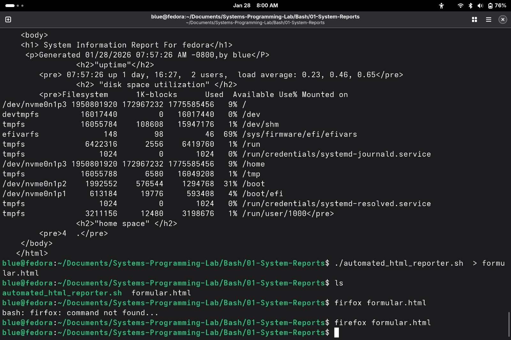

# 📊 System Reporting
This module focuses on extracting system telemetry (uptime, disk usage, memory) and converting raw terminal data into structured formats.

## 🛠️ Tools
- **automated_html_reporter.sh**: Generates a professional HTML report of system health.
- **formular.html**: The template/output used for web-based data presentation.

