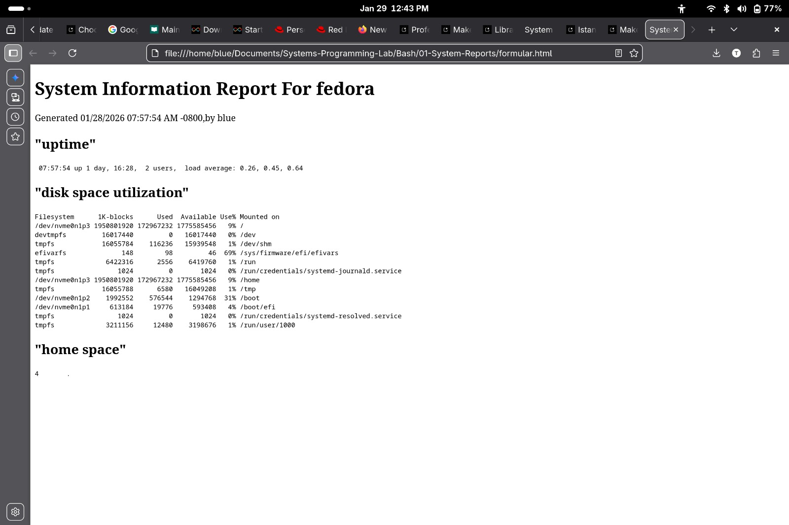

# 📊 System Reporting

This module focuses on extracting system telemetry (uptime, disk usage, memory) and converting raw terminal data into a structured web format.

## 🛠️ Tools & Outputs

### 1. [automated_html_reporter.sh](./automated_html_reporter.sh)
A Bash script that utilizes `Heredocs` to automate the generation of a system status report. It captures real-time data using `uptime`, `df`, and `du` commands.

### 2. [formular.html](./formular.html)
This is the live HTML output generated by the script. It provides a clean, readable interface for monitoring system health from any web browser.

---

#### Generated HTML Report (Browser View)

#### Script Terminal Execution

---
**Author:** Usman O. Olanrewaju (Blu3 Sky)
