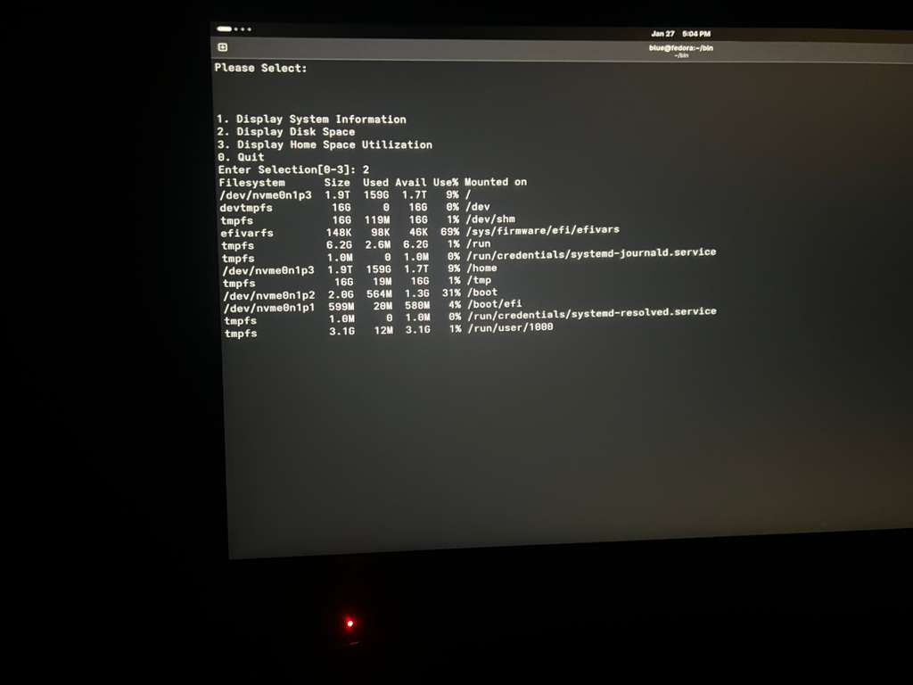

# 🐚 Bash Scripting & Automation Lab

This directory documents my proficiency in shell scripting, ranging from foundational exercises in "The Linux Command Line" to custom-built administrative utilities.

## 📂 Laboratory Modules

### [01. System Reports](./01-System-Reports)
- **Tool:** `automated_html_reporter.sh`
- **Focus:** Generating automated HTML system telemetry reports (Uptime, Disk, etc.).

### [02. Interactive Tools](./02-Interactive-Tools)
- **Tools:** `system_dashboard.sh`, `admin_helper.sh`
- **Focus:** Building user-friendly CLI interfaces using `while` loops, `Heredocs`, and the `select` built-in.
- **Evidence:** 

### [03. Automation Research](./03-Automation-Research)
- **Tool:** `variable_scope.sh`
- **Focus:** Understanding data isolation and the `local` keyword within shell functions.

### [04. Loop Syntax Comparison](./04-Loop-Syntax-Comparison)
- **Tool:** `loop_comparison.sh`
- **Focus:** Comparing POSIX-standard loops with C-style `for` loops in Bash.

### [05. Input Validation Lab](./05-Input-Validation-Lab)
- **Tool:** `character_classifier.sh`
- **Focus:** Using **POSIX character classes** (`[[:upper:]]`, etc.) and `case` logic for robust data handling.

---
**Environment:** Framework 13 / Fedora / Rocky Linux  
**Standard:** All scripts are POSIX-compliant and linted for efficiency.
