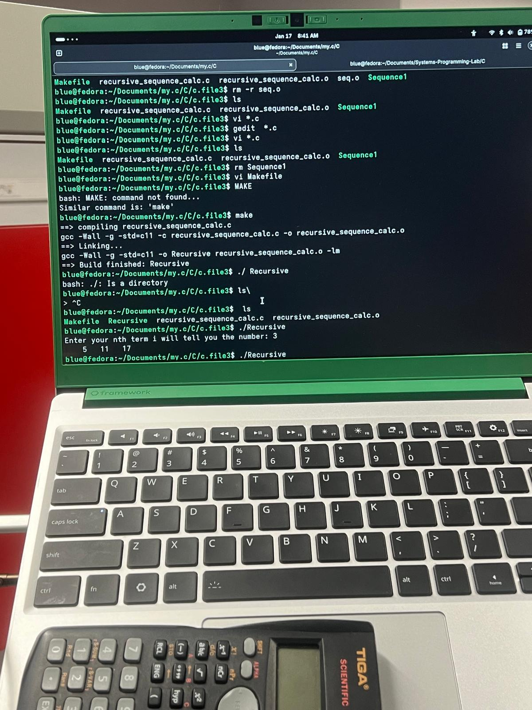
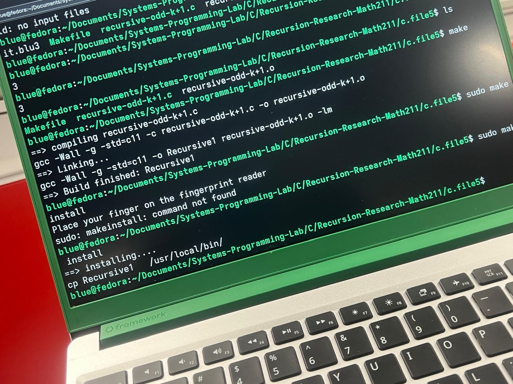
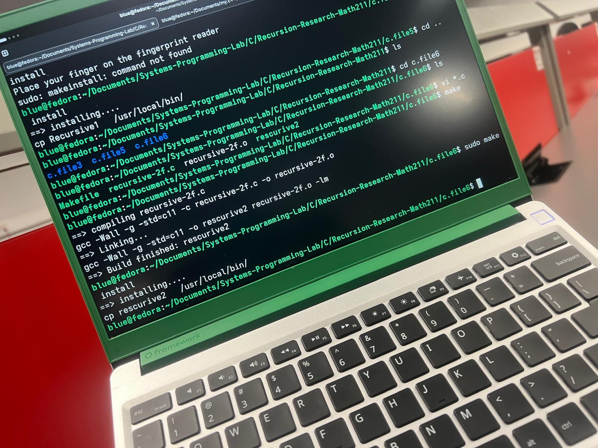

## 📐 Mathematical Induction & Recursive Proofs
This section of the lab focuses on verifying discrete mathematical conjectures through C implementations. 

### 🔬 Formulas Explored:
1. **Arithmetic Progression:** a + (n-1)u — Verifying step-wise growth logic.
### 🔬 Arithmetic Progression

2. **Square Series Induction:** (k+1)^2 — Implementing quadratic recursive expansion.

### 🔬 Square Series Induction

3. **Linear Recurrence:** 2*(n-1) +3 — Analyzing coefficient-based recursive depth.
### 🔬 Linear Recurrence

**Engineering Note:** Every formula here is tested for base-case validity and recursive step correctness, simulating the process of a formal mathematical proof.
