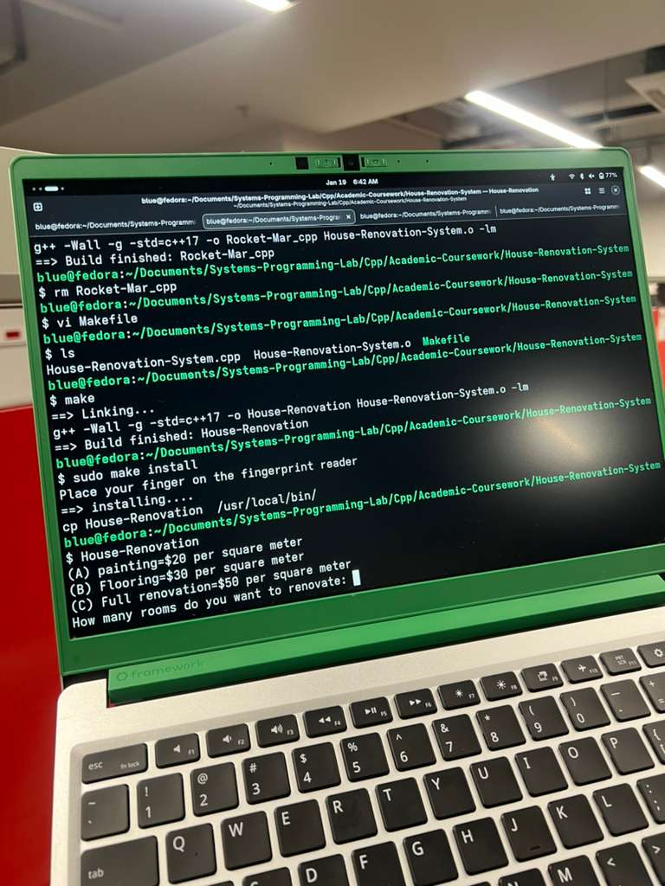
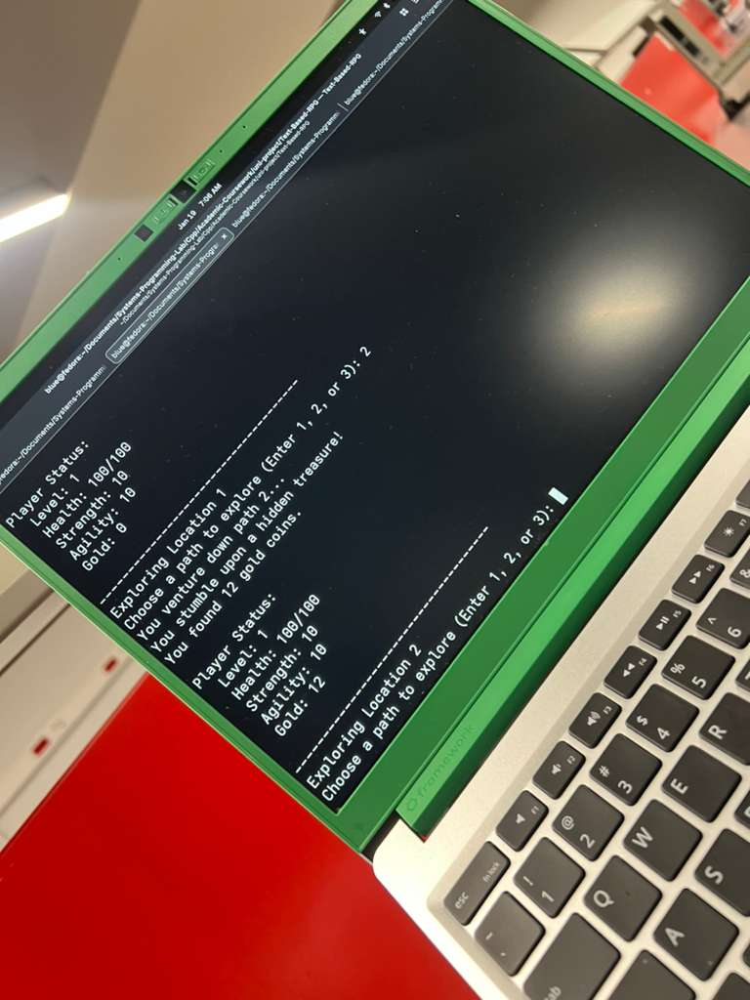
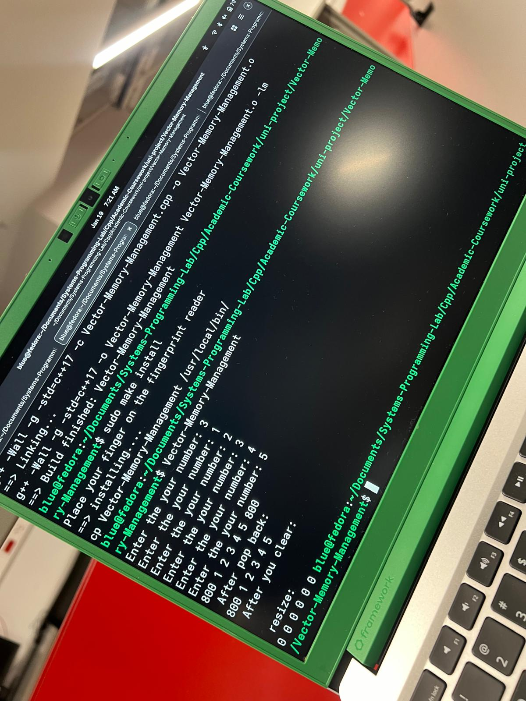

# 🎓 C++ Academic Coursework

This directory serves as a comprehensive record of labs and projects completed during my **Computer Engineering** degree at Altınbaş University. Each module focuses on a specific pillar of software engineering, from basic Object-Oriented principles to advanced memory management.

## 📂 Laboratory Modules

### [01. House Renovation System](./01-House-Renovation)
- **Focus:** Class structures and **Constructor Overloading**.
- **Objective:** Managing object lifecycles and state initialization.
### 🖼️ Lab Preview

### [02. Rocket Trajectory Simulation](./02-Rocket-Simulation)
- **Focus:** Mathematical modeling and physics simulation.
- **Objective:** Using C++ to solve complex arithmetic and iterative calculations.
### 📺 Simulation Video
<video src="../Images-Videos/Rocket-moving-to-mars.mp4" width="100%" controls></video>
### [03. Student Registry System](./03-Student-Registry)
- **Focus:** **Manual Memory Management** (Heap allocation).
- **Objective:** Understanding `new` and `delete[]` for dynamic data structures.
### 📺 System Walkthrough
<video src="../Images-Videos/Student_Billing_System.mp4" width="100%" controls></video>

### [04. Text-Based RPG State Machine](./04-Text-Based-RPG)
- **Focus:** State management and randomization logic.
- **Objective:** Designing an interactive CLI system with branching logic.
### 🖼️ Gameplay Screenshot

### [05. Vector Memory Management](./05-Vector-Memory-Management)
- **Focus:** **STL (Standard Template Library)** and Raw Pointers.
- **Objective:** Analyzing how high-level containers interact with low-level memory addresses.
### 🖼️ Memory Analysis

---

## 🛠️ Engineering Environment
- **Hardware:** Framework 13 (Modular Design)
- **Compiler:** GCC (g++) on Fedora Linux
- **Automation:** Standardized Makefiles for all modules

**Author:** Usman O. Olanrewaju (Blu3 Sky)
