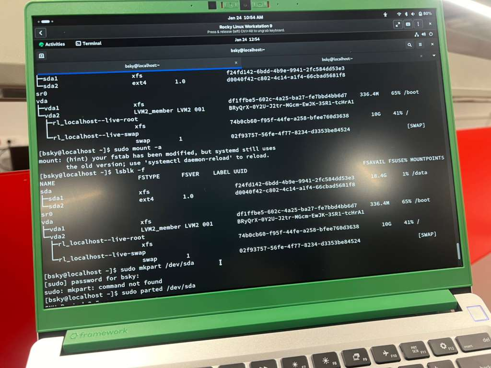
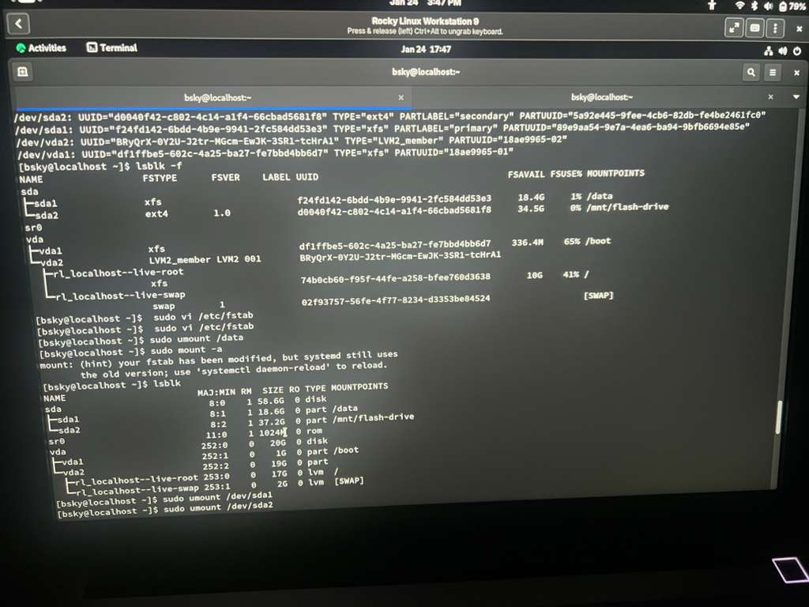
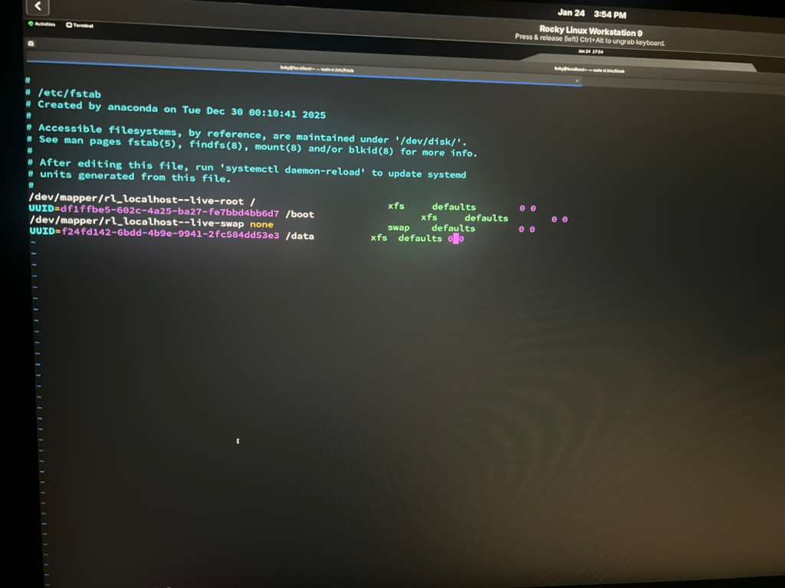

#!/bin/bash
# Author : usman O. Olanrewaju (Blu3 Sky) 
# Date: 2026/01/24
# Title: How to part and mount ==============================================================================
#
# Mounting and Parted 
# Mount: mount is a place/location where data are placed and access mount is a command used to attach a 
# formatted partition to a specific directory in your file system 
# Parted:  Parted  is a low-level utility used to create, destroy, resize, and manage partitions on a hard 
# drive.
# command and steps =================================================================================
# lsblk : to check the disk(sda,sdb,sdc) 
# sudo parted /dev/(name of the disk you want to parted i.e  the name you got from lsblk either sda ...) 
#
# command to use when you get the new screen from parted ====================================================
# print : to get/check the file system 
# mkpart: this is to make part 
# name will be ask: you can put a name (primary,seconday) 
# file system type : ntfs ,xfs , ext4,vfat ...........
# start : this is the starting point of the size  e.g start : 1  
# End : this is the end  point (put the number you the  end size ) e.g end: 10000 
#  (THIS IS 10GB DISK SIZE ADDED )
# print 
# quit 
#
# note: if you try to make part and it say "name problem" you need to mklabel such as gpt MBR and to remove 
# a parted 
# here are the command================================================================================
# mklabel name (gbt or MBR) e.g mklabel gbt 
# rm number (the is the number you got from print) e.g  rm 1
#
#
# out from the parted side we need to format so it can sync and sit well with the kernel ====================
#
# command to use===================================================
#
# sudo mkfs.(file system name) /dev/(name of the disk) e.g mkfs.xfs -f /dev/sdb  e.g mkfs.ext4 /dev/sdb
# note: you wait untill the  terminal come back DO NOT INTERRUPT
#
# lsblk -f : to get the file system type and see details of the file system 
#
#===============Mounting=============================================================
# sudo mkdir /data (i make this dir to mount too ) 
#
# sudo mount /dev/sdb1 /data 
#
# lsblk -f 
#
# =============Editing /etc/fstab =========================================================
#
# frist to do is get & confirm UUID 
# 
# lsblk -f : you get the UUID 
# sudo blkid : confirm the it same 
# sudo vi /etc/fstab 
# ====================Adding the UUID ===============================================================
# UUID=(UUID You get from blkid) (mounting point)   (file system type)  defaults 0 0 
#
#e.g 
# UUID=23457549492 /data xft defaults 0 0
#
# ===================umount======================================================================
# sudo umount /data 
#
# lsblk -f : confirm the umount 
#
# ==================mounting with /etc/fstab ==========================================================
#
# sudo mount -a 
#
# lsblk -f : you should see it mounted ================================================================
#
#
#
#
### 🖼️ Lab Evidence

### 1. Disk Partitioning with Parted

### 2. File System & UUID Identification

### 3. Persistent Mount Configuration (/etc/fstab)

